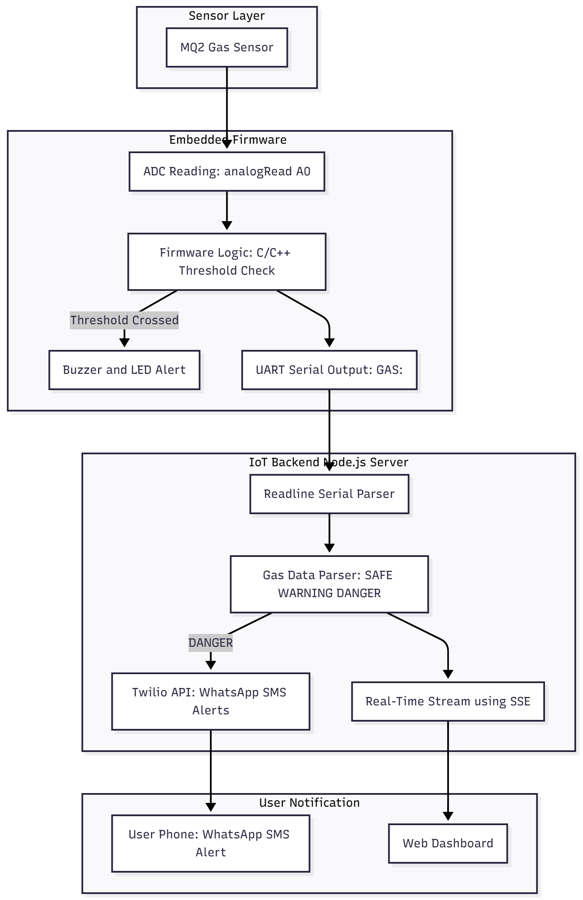
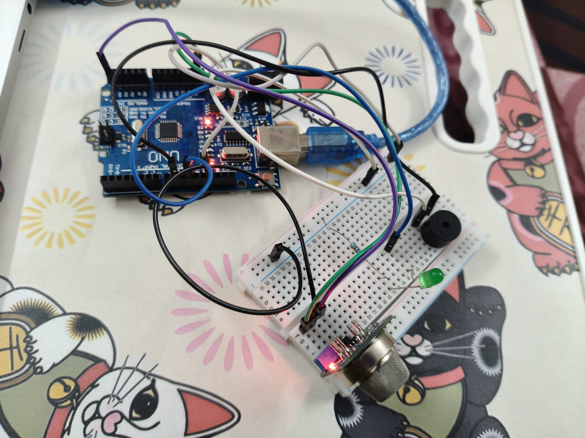

# 🚨 Smart IoT Gas Leakage Detection System

**Embedded Firmware + Real-Time WhatsApp/SMS Alerts using Twilio**

A complete IoT safety solution using an MQ-2 gas sensor, Arduino-based embedded firmware, UART communication, and a Node.js backend that sends WhatsApp/SMS alerts through Twilio during hazardous gas conditions.

---

## 📌 Overview

This project continuously monitors gas levels, triggers local alerts through buzzer/LED, and sends remote emergency alerts through a cloud-based backend.

Designed as a **real-world embedded IoT application**, it showcases firmware development, sensor interfacing, communication protocols, and cloud integration.

---

# 🧱 System Architecture (Add Your PNG Here)

🔽 **Add your exported architecture diagram (architecture.png) below**



---

# 🔌 Circuit Diagram (Add Your PNG Here)

🔽 **Add your circuit diagram (circuit.png) below**



---

# ⭐ Features

- Real-time gas monitoring
- Embedded firmware using **C/C++**
- Threshold-based buzzer & LED alerts
- UART serial communication (Arduino → Backend)
- WhatsApp/SMS alerts using Twilio Messaging API
- Live dashboard using Server-Sent Events (SSE)
- Complete end-to-end IoT + Embedded workflow

---

# 🧰 Tech Stack

### **Embedded / Firmware**

- Arduino UNO
- MQ-2 Gas Sensor
- Buzzer / LED
- ADC, GPIO, UART
- C/C++ Firmware

### **Backend / Cloud**

- Node.js
- Express.js
- Twilio API (WhatsApp/SMS)
- SerialPort Library
- SSE (Real-Time Updates)

---

# 📂 Folder Structure

```
iot-gas-detection-embedded-system/
│
├── backend/
│   ├── server.js
│   ├── .env
│   └── public/
│
├── firmware/
│   └── gas_firmware.ino
│
├── docs/
│   ├── architecture.png
│   ├── circuit.png
│   └── report.pdf
│
├── .gitignore
└── README.md
```

---

# 📡 How It Works (High-Level)

1. MQ-2 sensor reads gas concentration
2. Embedded firmware processes analog readings
3. If threshold exceeded → buzzer & LED activate
4. Arduino sends gas values via UART
5. Node.js backend parses data
6. If DANGER → Twilio sends WhatsApp/SMS alert
7. Live dashboard updates via SSE

---

# 🧪 Gas Levels

| Gas Reading | Status     | Description                       |
| ----------- | ---------- | --------------------------------- |
| 0–200       | SAFE 🟢    | Normal conditions                 |
| 201–350     | WARNING 🟡 | Elevated gas detected             |
| 351+        | DANGER 🔴  | Hazardous level, alerts triggered |

---

# 👨‍💻 Author

**Dwiden Brahma (NIT Warangal)**  

---

# 🎉 Thank You for Viewing This Project!

Feel free to open issues or contribute.
